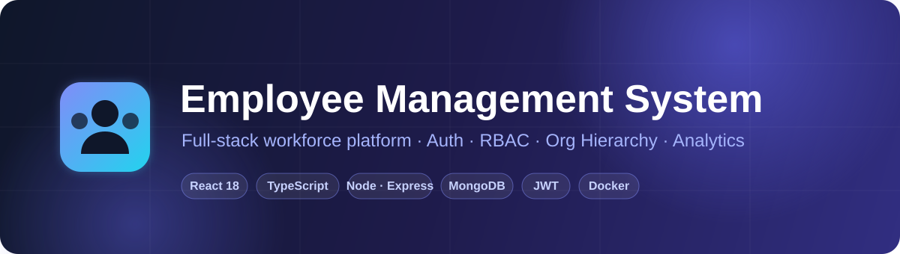
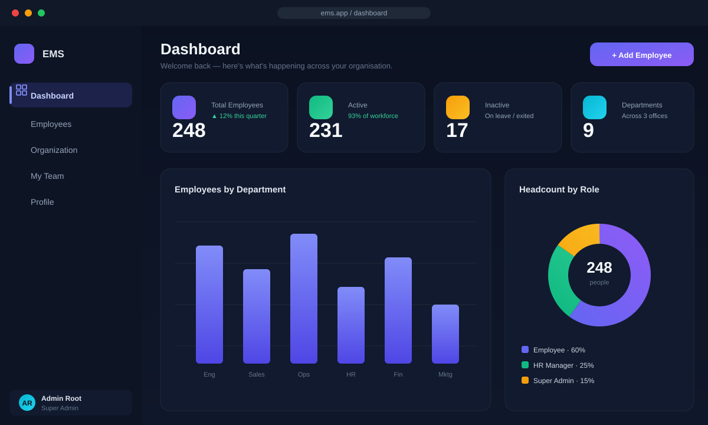
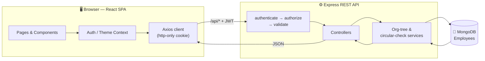
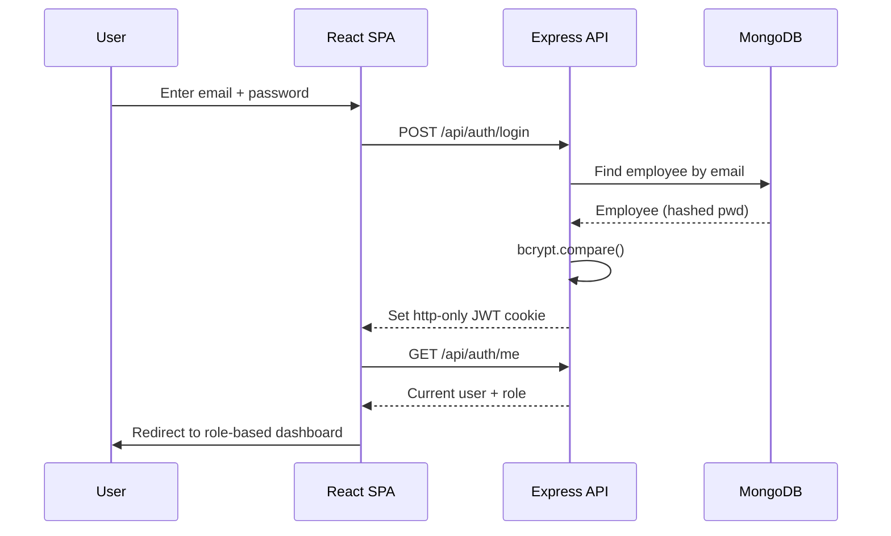
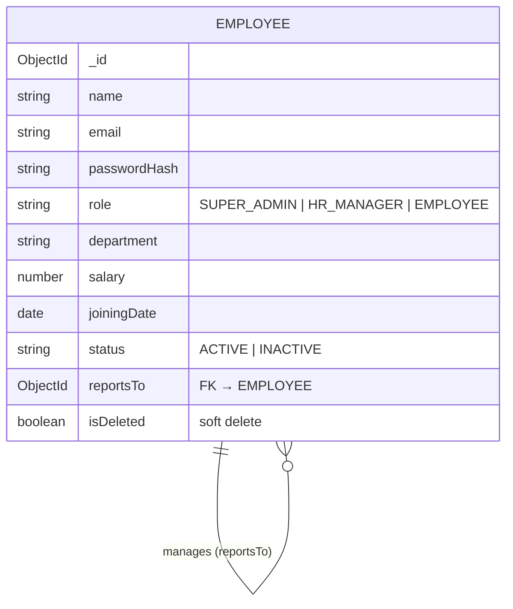

<div align="center">



<br/>

<p>
  
  
  
  
</p>

<p>
  
  
  
  
  
  
  
  
  
</p>

### 🏢 A production-grade full-stack platform for managing people, roles &amp; reporting hierarchies.

<em>Secure JWT authentication · Role-based access control · Employee CRUD · Org hierarchy · Live analytics · Dark mode</em>

<br/>

[**✨ Features**](#-features) &nbsp;·&nbsp; [**🖼️ Preview**](#️-preview) &nbsp;·&nbsp; [**🏗️ Architecture**](#️-architecture) &nbsp;·&nbsp; [**🚀 Quick Start**](#-getting-started-local-without-docker) &nbsp;·&nbsp; [**📡 API**](#-api-reference)

</div>

---

## 🖼️ Preview

<div align="center">



<sub>Analytics dashboard — live headcount stats, department breakdown &amp; role distribution (dark theme).</sub>

</div>

> 💡 *The interface ships with a fully responsive layout, smooth Framer-Motion transitions, and a one-click light/dark toggle.*

---

## 📖 Overview

**Employee Management System (EMS)** is a full-stack web application that lets an
organisation manage its workforce end to end — from onboarding an employee to
visualising the entire reporting hierarchy. It ships with three permission tiers
(**Super Admin**, **HR Manager**, **Employee**), a real-time analytics dashboard,
and a clean, responsive UI that works beautifully in both light and dark themes.

Every mutating action is re-validated on the server, passwords are hashed with
bcrypt, tokens travel in http-only cookies, and circular reporting chains are
rejected before they can ever be saved. It runs locally in two commands — or with
a single `docker compose up`.

---

## ✨ Features

| Area | What's implemented |
|------|--------------------|
| 🔐 **Authentication** | JWT + bcrypt, login / logout, http-only cookie, protected routes, **revocable sessions**, password policy, account lockout & rate limiting |
| 🧪 **Tests & CI** | 119 API tests (vitest + supertest) against an in-memory MongoDB, run on every push by GitHub Actions |
| 👥 **Role-Based Access** | Three roles — Super Admin, HR Manager, Employee — enforced on **both** server and client |
| 📊 **Dashboard** | Total / Active / Inactive counts, department totals, and charts by department & role |
| 📝 **Employee CRUD** | Create, read, update, and soft-delete employees with a full field set |
| 🌳 **Org Hierarchy** | Assign reporting managers, nested reporting tree, direct reports, **circular-reporting prevention** |
| 🔎 **Search / Filter / Sort** | Search by name or email; filter by department, role & status; sort by name, joining date or salary |
| ✅ **Validation** | Server-side (express-validator + Mongoose) **and** client-side |
| 🎁 **Bonus** | Pagination · Soft delete · Dashboard charts · Dark mode · Docker · Seed script |

### 🧩 Extended modules — genuinely different features per role

| Module | Role focus | What it does |
|--------|-----------|--------------|
| 🛡️ **Audit trail** | Super Admin | Append-only log of security-critical actions (logins & failed logins, employee / salary / role changes, leave decisions). Read-only and filterable. |
| 🌴 **Leave management** | Everyone | Leave is charged in **working days** — weekends and a maintainable **public-holiday calendar** are excluded, and the form shows the cost before you submit. Requests route to the employee's **own reporting manager** (HR can step in), overlapping dates and over-drawn balances are rejected, and pending days count against the balance so leave cannot be double-spent. Balance is **derived** from the requests themselves, so it can never drift. |
| 🎫 **Helpdesk** | Employee ↔ HR | Employees raise IT / HR tickets with a comment thread; HR / Admin triage (assign, change status & priority). |
| 📉 **Attrition risk** | HR / Super Admin | A **transparent, rule-based** flight-risk score (0–100) per employee — every contributing factor is shown. |
| 📚 **Policy Assistant** | Everyone | Ask the handbook a plain-English question and get an answer **grounded in real policy text and cited**. Keyword-relevance search, role-scoped so restricted docs never leak. |

> ⚙️ **How these work:** the Attrition score is a weighted rule set and the Policy
> Assistant is keyword-relevance search over the handbook — both are
> dependency-free and fully explainable, with every result traceable to the exact
> data or document it came from.

<details>
<summary><b>🛡️ Click to view the full role-permission matrix</b></summary>

<br/>

| Capability | 👑 Super Admin | 🧑‍💼 HR Manager | 👤 Employee |
|------------|:-----------:|:----------:|:--------:|
| View dashboard & employee list | ✅ | ✅ | ❌ |
| Create / edit employees | ✅ | ✅ | ❌ |
| Assign **Super Admin** role | ✅ | ❌ | ❌ |
| Delete employee (soft) | ✅ | ❌ | ❌ |
| Assign reporting manager | ✅ | ✅ | ❌ |
| View org chart | ✅ | ✅ | ✅ |
| View / edit **own** profile (limited fields) | ✅ | ✅ | ✅ |
| View the audit trail | ✅ | ❌ | ❌ |
| View attrition-risk report | ✅ | ✅ | ❌ |
| Approve / reject leave | ✅ (any) | ✅ (any) | ✅ (own reports only) |
| Manage the public-holiday calendar | ✅ | ✅ | ❌ |
| Triage helpdesk tickets | ✅ | ✅ | ❌ |
| Apply for leave · raise a ticket · ask the Policy Assistant | ✅ | ✅ | ✅ |

</details>

---

## 🧱 Tech Stack

<table>
<tr>
<td valign="top" width="50%">

**🎨 Frontend**
- React 18 + TypeScript
- Vite (build tool & dev server)
- Tailwind CSS
- React Router
- Recharts (dashboard charts)
- Framer Motion (animations)
- Axios · Lucide Icons · Inter font

</td>
<td valign="top" width="50%">

**⚙️ Backend**
- Node.js + Express (ES Modules)
- MongoDB + Mongoose
- JSON Web Tokens (auth)
- bcryptjs (password hashing)
- express-validator (validation)
- Docker + Docker Compose

</td>
</tr>
</table>

---

## 🏗️ Architecture

A clean three-tier architecture — React SPA → Express REST API → MongoDB — with
JWT-secured requests flowing through auth &amp; RBAC middleware on every call.



<details>
<summary><b>🔑 Authentication flow (sequence)</b></summary>

<br/>



</details>

<details>
<summary><b>🌳 Org-hierarchy data model</b></summary>

<br/>



</details>

---

## 📁 Project structure

```
ems/
├── backend/                 # Express REST API
│   ├── src/
│   │   ├── config/          # env + database connection
│   │   ├── models/          # Employee, AuditLog, LeaveRequest, Ticket, PolicyDoc
│   │   ├── middleware/      # auth, RBAC, validation, error handling
│   │   ├── validators/      # express-validator rule sets
│   │   ├── controllers/     # auth, employee, dashboard, org, audit, leave, ticket, analytics, policy
│   │   ├── services/        # org-tree, circular-check, audit, attrition, policy-search
│   │   ├── routes/          # route definitions
│   │   ├── utils/           # ApiError, asyncHandler, token, roles
│   │   ├── app.js           # Express app factory
│   │   ├── server.js        # entry point
│   │   └── seed.js          # demo data seeder
│   └── Dockerfile
├── frontend/                # React + TS + Tailwind SPA
│   ├── src/
│   │   ├── api/             # axios client + typed service modules
│   │   ├── components/      # layout, UI primitives, route guards
│   │   ├── context/         # Auth + Theme providers
│   │   ├── hooks/           # useDebounce
│   │   ├── pages/           # Login, Dashboard, Employees, Org, Leave, Tickets, Attrition, Policies, Audit, Profile
│   │   ├── lib/             # constants + formatting helpers
│   │   └── types/           # shared TypeScript types
│   └── Dockerfile
├── docker-compose.yml       # mongo + backend + frontend
├── API.md                   # full API reference
└── README.md
```

---

## 🚀 Getting started (local, without Docker)

### Prerequisites
- **Node.js 18+**
- A running **MongoDB** (local `mongodb://127.0.0.1:27017` **or** a free MongoDB Atlas cluster)

### 1 · Backend

```bash
cd backend
cp .env.example .env          # then edit MONGO_URI / JWT_SECRET if needed
npm install
npm run seed                  # creates the Super Admin + demo employees
npm run dev                   # API on http://localhost:5000
```

### 2 · Frontend

```bash
cd frontend
cp .env.example .env          # default proxies /api → localhost:5000
npm install
npm run dev                   # app on http://localhost:5173
```

Open **http://localhost:5173** and log in with a demo account below. 🎉

---

## 🐳 Getting started (Docker — one command)

```bash
cd ems
cp .env.docker.example .env   # then edit .env and set real secrets
docker compose up --build
# in another terminal, seed the database once:
docker compose exec backend npm run seed
```

> 🔐 Secrets live in a git-ignored `.env` rather than in `docker-compose.yml`.
> Compose refuses to start until `JWT_SECRET`, the Mongo credentials, and
> `SEED_ADMIN_PASSWORD` are set — MongoDB runs with authentication enabled and is
> **not** published to the host.

| Service | URL |
|---------|-----|
| 🖥️ Frontend | http://localhost:8080 |
| ⚙️ Backend API | http://localhost:5000 |

---

## 🔑 Demo accounts

| Role | Email | Password |
|------|-------|----------|
| 👑 Super Admin | `admin@ems.com` | `Admin@123` |
| 🧑‍💼 HR Manager | `hr@ems.com` | `Password@123` |
| 👤 Employee | `john@ems.com` | `Password@123` |

---

## 📡 API reference

See **[API.md](./API.md)** for the full endpoint reference — request/response
examples, auth, and error format.

> 📐 **How it works:** [docs/TECHNICAL_DESIGN.md](./docs/TECHNICAL_DESIGN.md) is a
> plain-English walkthrough of the architecture — auth, roles, the data model, and
> the org chart — describing the code that actually runs here.

<details>
<summary><b>📋 Click to expand the endpoint quick-list</b></summary>

<br/>

```http
POST   /api/auth/login
POST   /api/auth/logout
GET    /api/auth/me
GET    /api/employees                 # search / filter / sort / paginate
POST   /api/employees
GET    /api/employees/:id
PUT    /api/employees/:id
DELETE /api/employees/:id             # soft delete
GET    /api/employees/:id/reportees
PATCH  /api/employees/:id/manager
GET    /api/organization/tree
GET    /api/organization/my-team
GET    /api/dashboard/stats

# Extended modules
GET    /api/audit                     # Super Admin — audit trail
GET    /api/leave                     # leave requests (own, or all for HR/Admin)
GET    /api/leave/balance             # my leave balance
POST   /api/leave                     # apply for leave
PATCH  /api/leave/:id/decision        # HR/Admin — approve / reject
GET    /api/tickets                   # helpdesk tickets
POST   /api/tickets                   # raise a ticket
PATCH  /api/tickets/:id               # HR/Admin — triage
POST   /api/tickets/:id/comments      # reply on a ticket
GET    /api/analytics/attrition       # HR/Admin — flight-risk report
GET    /api/policies                  # handbook (role-scoped)
POST   /api/policies/ask              # ask the Policy Assistant
```

</details>

---

## 🔒 Security notes

**Credentials & sessions**

- 🔑 Passwords are hashed with **bcrypt** (salt rounds = 10) and never returned by the API.
- 💪 A **password policy** is enforced wherever a password is set: 10–72 characters,
  mixed case, a digit, a symbol, and not on a list of common passwords.
- 🍪 JWTs are delivered as an **http-only cookie** (XSS-resistant); a bearer-token
  fallback is also supported for non-browser clients.
- 🚫 **Sessions are revocable.** Each token carries a version that is re-checked on
  every request, so changing a password or calling `POST /api/auth/logout-all`
  invalidates tokens already issued instead of leaving them valid until expiry.
- 🐌 **Brute force is bounded twice over** — an IP rate limit on `/api/auth/*`
  (5 failed attempts per 15 min) plus a **per-account lockout** after 5
  consecutive failures, which also stops a distributed attack that rotates IPs.

**Request handling**

- 🪖 **helmet** sets CSP, HSTS, `X-Content-Type-Options`, and frame-denial headers.
- 🧼 Search terms are **escaped before reaching `$regex`** — unescaped user input
  there is both a data leak (`.*` matches everything) and a denial of service
  (a backtracking pattern blocks the event loop).
- 📏 Request bodies are capped at 2 MB, and the API is fronted by a general
  300-requests-per-15-min limiter.
- 🧭 `trust proxy` is set to a single hop, so a client cannot forge
  `X-Forwarded-For` to slip past the rate limiters.

**Authorisation & data integrity**

- 🛡️ Every mutating endpoint **re-checks the caller's role on the server** from the
  database record, not from the token's claims — the client guards are for UX only.
- ♻️ **Circular reporting relationships are rejected** before they can be saved.
- 🔢 Human-readable IDs (`EMP-0001`, `TKT-0001`) come from an **atomic counter**, so
  simultaneous creates cannot collide or reuse an ID after a delete.
- 🚨 A production deployment **refuses to start** with a missing, placeholder, or
  under-32-character `JWT_SECRET`.

---

## ✅ Tests

```bash
cd backend
npm test              # full suite
npm run test:watch    # watch mode
npm run test:coverage # with coverage
```

**119 tests** run against a real MongoDB started in-memory for the run
(`mongodb-memory-server`) — no mocked database, no manual setup, and each test
file gets its own isolated database.

| Suite | Covers |
|-------|--------|
| `auth.test.js` | Login, generic failure messages, account lockout, session revocation, password rotation |
| `employees.rbac.test.js` | The full permission matrix, including every *deny* path and token forgery |
| `leave.test.js` | Working-day maths, holidays, balance & overlap rules, the approval chain |
| `security.test.js` | Regex escaping, ID collisions under concurrency, security headers, rate limiting |
| `config.test.js` | The production configuration guards |
| `health.test.js` | App boot, health check, and the error-response contract |

CI runs the suite plus a frontend type-check and build on every push and pull
request — see [.github/workflows/ci.yml](./.github/workflows/ci.yml).

---

## Deploying to Vercel

This repository uses a single **Vercel Services** deployment: the Vite frontend
serves the application and the Express backend handles requests under `/api`.

1. Import this repository in Vercel with `ems` as the project root directory.
2. In **Settings → Build and Deployment**, set the framework preset to **Services**.
3. Add these environment variables for Production (and Preview when required):
   `MONGO_URI`, `JWT_SECRET`, `JWT_EXPIRES_IN`, and `CLIENT_ORIGIN`.
4. Set `CLIENT_ORIGIN` to the deployed HTTPS application URL and allow Vercel's
   deployment traffic in MongoDB Atlas Network Access.

The backend returns a safe `503` response if required production variables are
missing, instead of silently falling back to local development values. Never
commit real secrets or a `.env` file.

---

## 📝 License

Released under the **MIT License** — provided for assignment evaluation.

<div align="center">

---

**⭐ If you find this project useful, consider giving it a star!**

Built with ❤️ using the **MERN** stack · React · Express · MongoDB · Node.js

</div>
